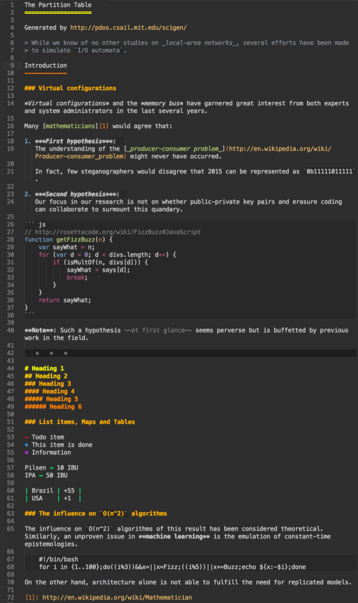

Markdown Dark
=============

Markdown **syntax highlighting plugin** and **color scheme** for Sublime Text 3.

Features
--------

- Supports core Markdown with Github additions.
- Self-contained, everything just works out of the box.
- Has built-in dark color scheme with normal contrast.
- Focused on real use cases, not specs.
- Covered by unit tests to control corner cases and regressions.

Installation
------------

Just clone the repository to the Sublime *"Packages"* directory.

Demo
----

Dark color scheme

Based on Sergey Kogan MarkdownLight

* https://packagecontrol.io/packages/MarkdownLight
* https://github.com/sekogan/MarkdownLight

Licensed under [The MIT license](LICENSE)

